# Windows 11 Tweaks - Build 22621.1778


[](CODE_OF_CONDUCT.md) &nbsp; [](LICENSE) &nbsp; [](https://github.com/zricethezav/gitleaks) &nbsp; [](https://github.com/kyaulabs/win11tweak/actions)\
[](https://semver.org) &nbsp; [](https://discord.gg/DSvUNYm)

## Disclaimer

Let's be honest, Windows has become a mammoth of an OS that is generically geared toward everyone. My goal with this set of scripts is to put the User back in control of the OS. That said, these scripts have been heavily customized to my own personal needs, it is highly recommended that if you are to use them you review them in their entirety first.

```
🚧 WARNING
This repository is provided for archival/educational purposes, I am not responsible for any data loss or
damage that may ensue.
```

* [Introduction](#introduction)
* [Features](#features)
  * [Configuration](#configuration)
* [Windows 11 Tweaks Guide](#windows-11-tweaks-guide)
  * [Installation](#installation)
  * [Windows Update](#windows-update)
  * [Windows Defender (optional)](#windows-defender-optional)
  * [Download Win11Tweaks](#download-win11tweaks)
  * [Anti-Virus (optional)](#anti-virus-optional)
  * [Running Win11Tweaks](#running-win11tweaks)
  * [Microsoft Edge Removal (optional)](#microsoft-edge-removal-optional)
  * [Anti-Virus Removal (optional)](#anti-virus-removal-optional)
  * [Configuring Windows](#configuring-windows)
  * [OpenShell](#openshell)
  * [Brave](#brave)
  * [Firewall](#firewall)
  * [Chocolatey](#chocolatey)
  * [Everything](#everything)
  * [CCleaner](#ccleaner)
  * [MSEdgeRedirect](#msedgeredirect)
* [Further Setup](#further-setup)
* [Attribution](#attribution)

## Introduction

This script is meant to be utilized immediately after a fresh installation of Windows 11. Before the script can be run, Windows itself needs to be installed properly. The following will walk you through setting up Windows 11 with a local user account.

## Features

This set of scripts attempts to maintain a vanilla appearance while gutting most of the unneeded and/or unwanted items from the operating system. Privacy is another focus and as such any call home or telemetry functions have been disabled or out-right removed.

* Microsoft Bloat Removed

* Microsoft Telemetry/Tracking Stripped

* *(Optional)* Microsoft Edge Completed Removed

* *(Optional)* Windows Defender Completed Removed

* Chocolatey Package Manger, manage packages like a Linux system

* MSYS2 is used for a Linux terminal

* Git for Windows directly integrated into MSYS2, this uses the faster native version of Git with the added benefit of being able to use the default MSYS2 package manager `pacman` [^1]

* YubiKey Ready! [^2]

* *(Optional)* GPG and SSH key forwarding over SSH

* Many Visual Changes!
  
  * Start Menu shifted back to the left
  
  * Original Windows right-click menu restored
  
  * OpenShell is used for a customizable start menu experience

[^1]: Install Git for Windows inside MSYS2 proper [git-for-windows/git](https://github.com/git-for-windows/git/wiki/Install-inside-MSYS2-proper)
[^2]: This assumes you followed [drduh's YubiKey Guide](https://github.com/drduh/YubiKey-Guide) in order to setup your YubiKey

### Configuration

While not required, in order to personalize your installation, it is recommended to edit `user_settings.ps1`.  Use any text editor or regular old Notepad to edit the file. This step will need to be done before the script can be run on a fresh installation. However, as Win11Tweaks can be baked into an installation to be run automatically, I have added this section up near the top so it does not get skipped over.

```
📌 NOTE
By default this file contains all of my own personal settings. At the very least you should change the Git
Email, GPG Public Key and then review over the list of software that Chocolatey is going to be installing.
```


## Windows 11 Tweaks Guide

### Installation

While this can be used with any version of Windows 11, this guide revolves around Windows 11 Pro N. In order to bypass the Microsoft Account requirements it is advised that you pull your network cable until Windows 11 is fully installed.

```
❗ DO NOT SKIP ❗
If you do not plan on pulling your network cable you will be forced into logging in with a Microsoft
Account.
```


After installing Windows to the selected hard drive you will be prompted to reboot the computer. Upon completion, press `SHIFT+F10` to bring up a command prompt window.


Run `oobe\bypassnro` in the command prompt window, this will reboot the machine automatically and then return you to the region selection window.


Begin by selecting a region and keyboard (and a secondary keyboard layout if necessary).

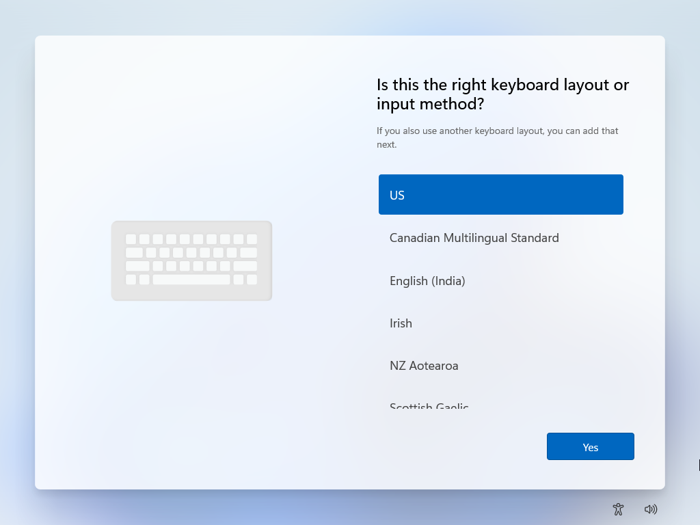

Windows will now prompt you about having no internet connection, select `I don't have internet`.

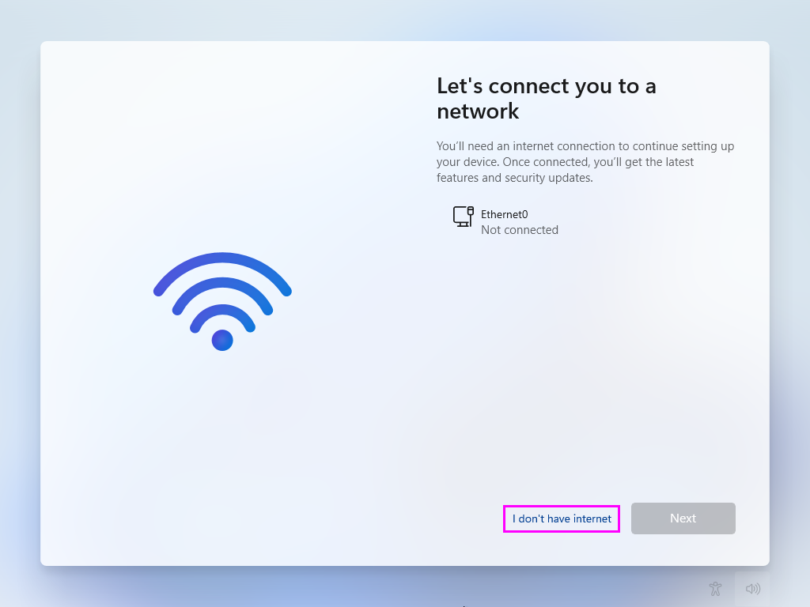

It will double check that you are sure about using an offline account, select `Continue with limited setup`.


Set your desired username.


Set and confirm your password.


Fill in the three security questions.


Finally on the privacy settings screen, make sure you deselect every single option (scroll down for more options). Only after you have turned off all of Microsoft's tracking should you select `Accept` to complete the Windows 11 configuration.


### Windows Update

Eventually you will be able to login and will then be presented with the desktop.

```
📌NOTE
Now would be an acceptable time to plug your network cable back in.
```

Right-click on the Start Menu icon (bottom center of screen, left most icon). From here you will want to select `Settings`.


Navigate to `Windows Update`.


From here update Windows, you need to continue to check for updates after every update until Windows tells you that `You're up to date`.


Don't forget to also install optional updates as these tend to contain drivers, these have been moved inside Advanced options.


This will most likely require a reboot or a few. Once complete open the Windows Store from the taskbar (the briefcase with the Windows logo on it). Open the `Library` from the bottom left of the app.

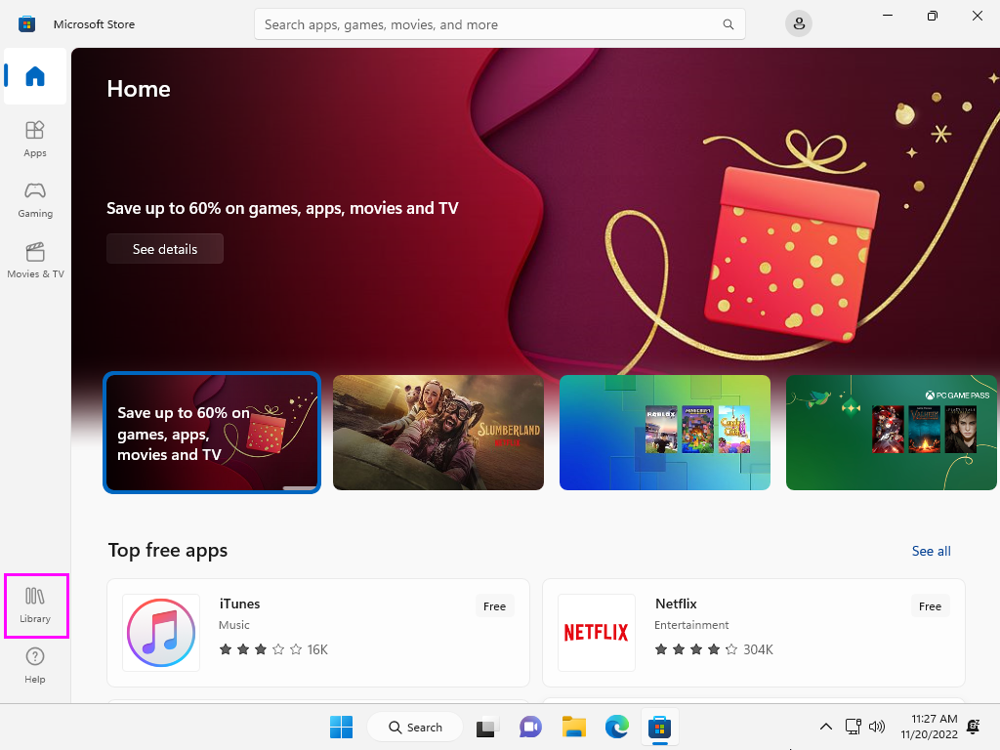

Select `Get updates` in the upper right corner of the window.


Verify that you have performed all updates by the store telling you `You're good to go`.


At this point (if it has not been done already) activate Windows.

With the computer updated and activated it is now time to download the script. Download the latest version of Win11Tweaks. Extract the contents of the ZIP file to the Desktop, this should place a folder `win11tweak` on the Desktop.

### Windows Defender (optional)

```
📌 NOTE
If you choose to keep Windows Defender installed, the script used to remove it 'defender.ps1' will get
flagged by Defender itself, this is normal behavior.
```
```
🚧 WARNING
Removal of Windows Defender WILL break the ability to use Windows Update!
```

Before the main script can be run Windows Defender needs to be disabled along with tamper protection.

Select the Security Center icon in the system tray and navigate to the security dashboard.

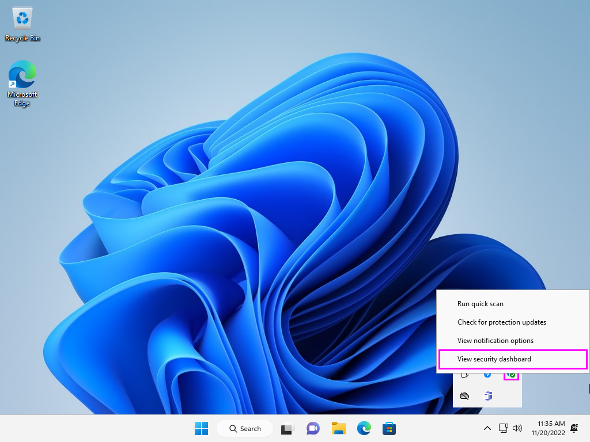

Navigate to `Virus & threat protection` and select `Manage settings`.


Turn off `Real-time protection`,  `Cloud-delivered protection`, `Automatic sample submission` and `Tamper Protection` inside of Virus & threat protection settings.

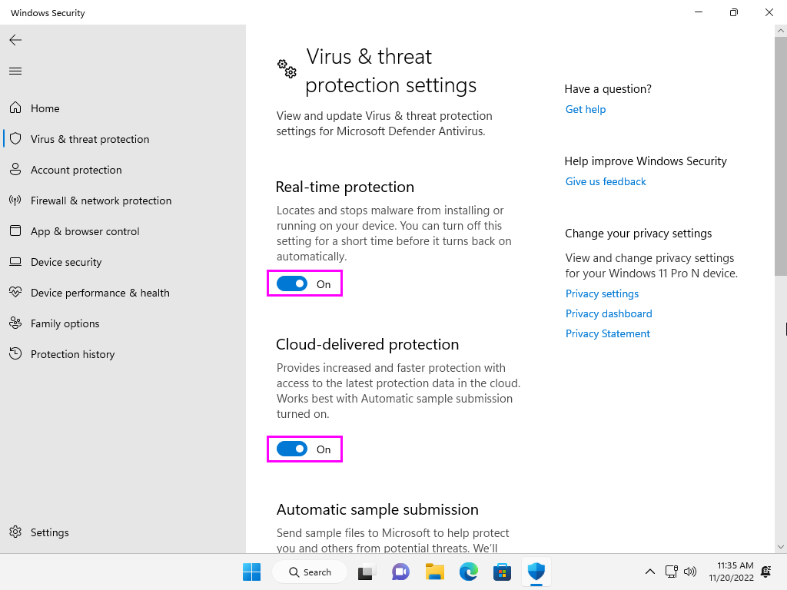

### Download Win11Tweaks

Right-click on the Start Menu icon and select `Terminal (Admin)`. Run the following command in PowerShell.

```powershell
iex ((New-Object System.Net.WebClient).DownloadString('https://github.com/kyaulabs/win11tweak/raw/master/Modules/download.ps1'))
```

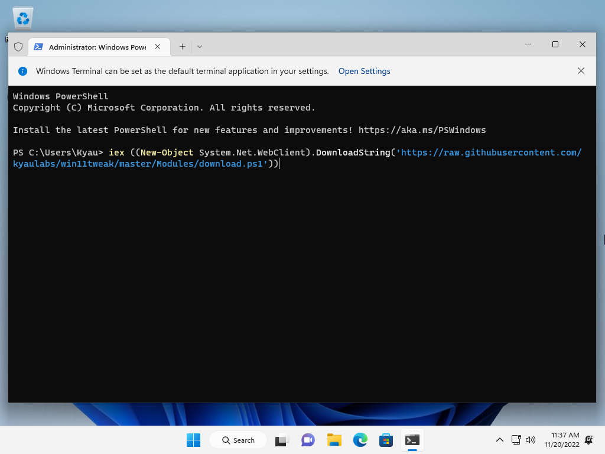

This will download a copy of Win11Tweaks and place it on your desktop. You can then close out of Windows Terminal.

### Anti-Virus (optional)

Run `download_av.cmd` inside of the `win11tweak` folder on the desktop.

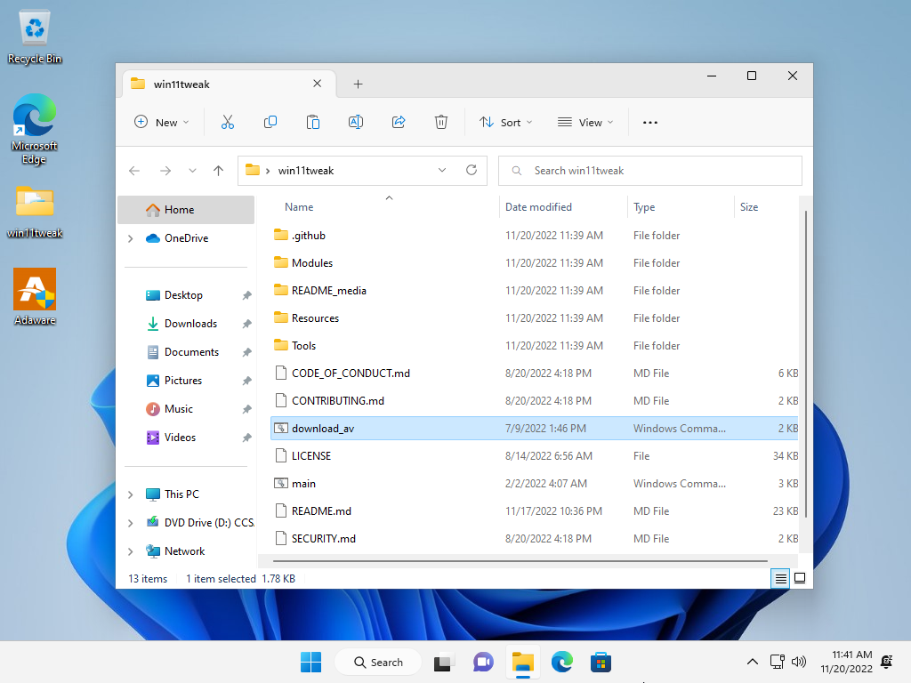

This will download Adaware Antivirus to your desktop, then run the installer `Adaware.exe`. Select `Install` to install Adaware.

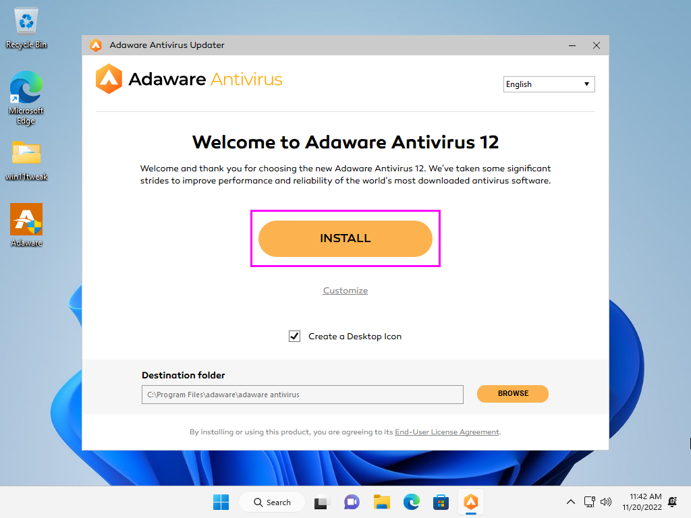

When asked if you want an extra layer of protection, select `NO THANKS`.


Once installation is finished, feel free to delete the `Adaware.exe` on your desktop.  If by chance MSEdge pops up with incoherent text, go to the Task Manager by right-clicking on the Start Menu and selecting `Task Manager`. Find `Microsoft Edge` and expand it to find `Browser`, right-click on this and choose `End task`.


Given a bit of time Adaware should finish its initial scan and present you with a screen similar to the following.


Close out of Adaware.

```
📌 NOTE
Installation of a 3rd party Anti-Virus product has been added in order to get Windows Defender to disable
itself. Without this step you will be unable to completely remove Windows Defender from Windows 11.
```

### Running Win11Tweaks

Assuming the scripts have been extracted to your Desktop... Open the start menu and search for `cmd`, this should bring up the listing for Command Prompt. Make sure you choose the option on the right `Run as administrator`.

```
🚧 WARNING
Do not simply run the script from Windows Explorer, this will fail and/or produce unintentional results.
```


Change directory into the extracted folder `cd %USERPROFILE%\Desktop\win11tweak`. 

Finally run the script using `main.cmd`.


The script will take quite a while to finish.

Upon completion it will reboot automatically. After the reboot the last part of the script will run automatically after login and then remove itself (via scheduled task).

### Microsoft Edge Removal (optional)

If chosen, at some point it will ask you to uninstall the two Microsoft Edge components. If this happens you will be presented with the following screen, make sure to select `Uninstall` for both.


```
❗ DO NOT SKIP ❗
It is possible that the second of which, uninstalling MSEdge itself, will popup two Internet Explorer
errors in the background. These errors will need to be cleared by ALT+TABing and selecting 'OK' before
the script can continue.
```

### Anti-Virus Removal (optional)

Once Win11Tweaks is completely done with all of its scripts, you will be left at the Windows Desktop. If you wish to remove all anti-virus completely, right-click the Start Menu and select `Installed apps`. Select the three-dot menu to the right of `adaware antivirus` and choose `Uninstall`.


Make sure to select `SKIP` when asked if you want to reenable Windows Defender.


Go ahead and reboot to complete the uninstallation.

Post reboot, if you open Security Center and navigate to `Virus & threat protection > Virus & threat protection settings` you will see that Windows Defender is completely disabled.


### Configuring Windows

Right-click on the desktop and choose `Personalize`. Navigate to `Themes` and set the mouse cursor theme to `Snow Leopard`.


Click `Color`, change `Choose your color` to `Custom` and then the default Windows mode to `Dark` and the default App mode to `Light`.

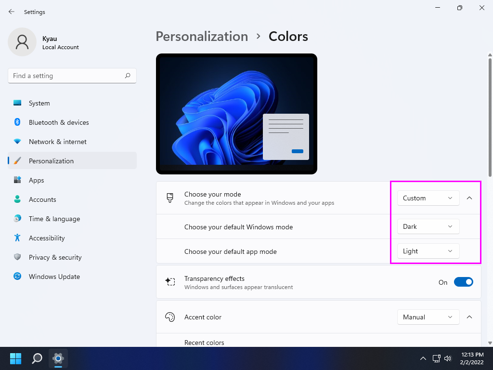

Set the accent color to `Manual` then click `View colors`. Selecting `More` will allow you to set a hex color code. Change it to `#131313` (Black) and enable accent color on `Start, taskbar, and action center` and `Title bars and window borders`.


### OpenShell

OpenShell, which is the continued version of ClassicShell, should be on the desktop with a settings XML file ready for import. Install OpenShell, removing the un-needed modules.

```
📌 NOTE
After OpenShell is installed you will find example shortcuts for SSH and RDP in the Start Menu under the
KYAU Labs section (feel free to rename to the name of your network).
```


After installation press the Windows key on your keyboard in order to open the settings dialog for Open-Shell. Click `Backup` and then `Load from an XML file...` choosing the provided XML file on the desktop.


```
📌 NOTE
OpenShell has not yet been fully updated for Windows 11, there are still quite a few bugs/glitches.
```

If you need to make changes to the Start Menu, enable `Show all settings` and then navigate to the `Customize Start Menu` tab.

When finished, select `OK` in the bottom right to save the changes. It will prompt you to Exit and reload OpenShell. Right-click the Start Menu and choose `Exit` (maybe twice). Then click the Start Menu and re-launch `Open-Shell Menu Settings`. Finally, select `OK` to close settings.

### Brave

```
🚧 WARNING
Naturally this can be replaced with a browser of your choosing, I would recommend you at least give Brave
a try if you have never used it.
```

Next, install the Brave web browser with the `BraveSetup.exe` on the desktop which has been pre-downloaded for you. Once open, feel free to click `Set Brave as default browser`, then `Skip` importing settings and finally uncheck both telemetry sharing options and select `Finish`.

Next scroll down a little to bring up the Brave News banner and select `No thanks`. Then select the 3dots menu for `Brave Rewards` and select `Hide Brave Rewards`.

Navigate to the hamburger menu in the upper-right and select `Extensions`. In the center you should see `Find extensions and themes in the Web Store`, click on `Web Store` to continue, this should launch in a separate tab.

Extensions are typical revolve heavily around personal choice, however there are a few extensions that deal with privacy/security that I would recommend to everyone.

* [Cookie AutoDelete](https://chrome.google.com/webstore/detail/cookie-autodelete/fhcgjolkccmbidfldomjliifgaodjagh)
* [Decentraleyes](https://chrome.google.com/webstore/detail/decentraleyes/ldpochfccmkkmhdbclfhpagapcfdljkj)
* [Privacy Badger](https://chrome.google.com/webstore/detail/privacy-badger/pkehgijcmpdhfbdbbnkijodmdjhbjlgp)

Navigate to the hamburger menu again and select Settings. Under `Appearance` set `Brave colors` to `Dark` to force Brave into dark mode.


Then select `Always show full URLs` and deselect `Top sites` under `Show autocomplete suggestions in address bar`.

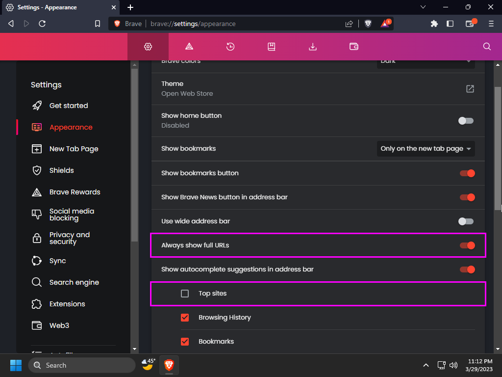

Under `Shields` change `Trackers & ad blocking` to `Aggressive`.


Under `Social media blocking` deselect all platforms that you do not use.


Under `Privacy and security` deselect everything.


Under `Search engine` swap the `Search engine used in the address bar` for `Normal Window` and `Private Window` to the one of your choice, I recommend `DuckDuckGo` personally.

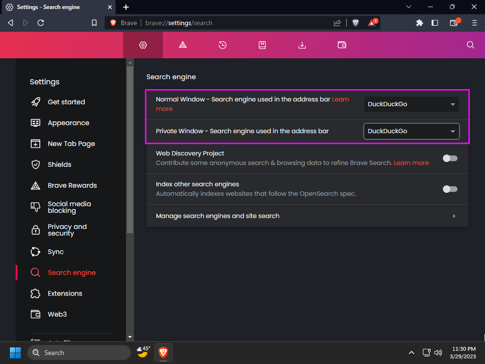

Under `Extensions` deselect `WebTorrent` if you use an external torrent client, and select `Widevine` if you plan on using streaming services with this browser.

```
📌 NOTE
Enabling Widevine DRM will require a restart of Brave, you will be returned to where you left off in
Settings after the restart.
```


Under `Autofill` > `Passwords` deselect `Offer to save passwords` and `Auto Sign-In`.


Under `Autofill` > `Payment methods` deselect `Save and fill payment methods` and `Allow sites to check if you have payment methods saved`.


Under `Autofill` > `Addresses and more` deselect `Save and fill addresses`.


### Firewall

In the Utilities section of the Start Menu is simplewall, launch it and allow it to update if needed.

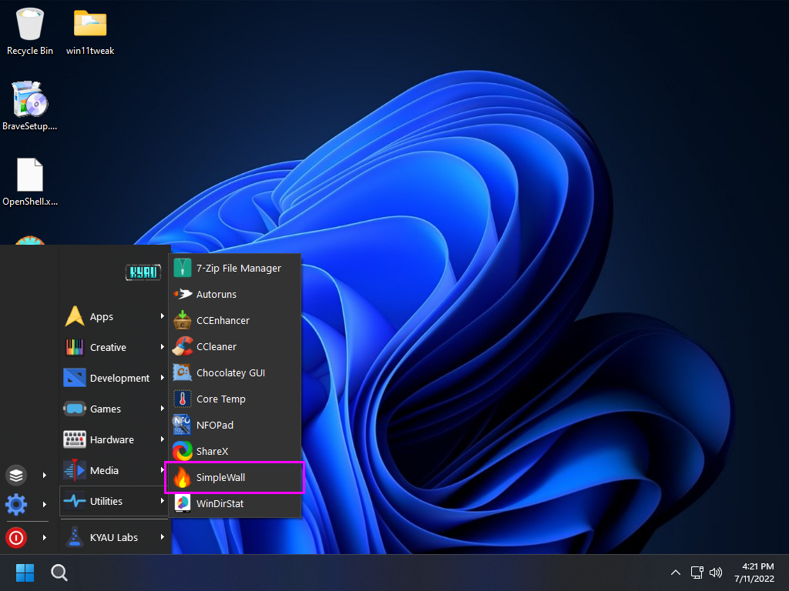

In the `Settings` menu enable `Load on system startup`,  `Start minimized`, and `Skip "User Account Control" prompt warning`.

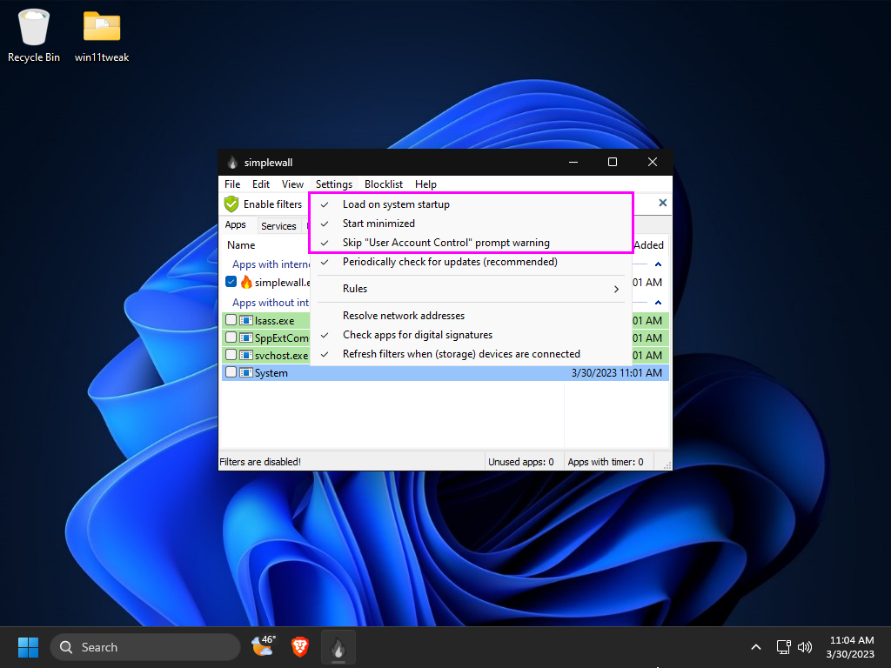

In the `Blocklist` menu enable `Microsoft update` by selecting `Allow` in the sub-menu.


Click `Enable filters` in the toolbar, making sure to uncheck `Disable Windows Firewall` then again clicking `Enable filters` in the popup dialog in order to permanently activate simplewall.


```
📌 NOTE
simplewall can fully replace Windows Firewall however in Windows 11 this will trip the firewall
failure inside of Windows Security (what use to be called Security Center).
```

Applications will popup asking for internet access, stuff that is required for Windows to function are as follows (it is safe to allow everything in this list):

* `dashost.exe`: wired/wireless device pairing
* `explorer.exe`: typically for SMB of NFS access (network drives)
* `Microsoft Content`: part of search
* `Microsoft Store`: the store uwp app
* `mousocoreworker.exe`: Windows update client
* `microsoftedgeupdate.exe`: Microsoft Web Browser Update
* `msedge.exe`: Microsoft Web Browser (if you are using a different one feel free to block this and the update above)
* `mstsc.exe`: remote desktop connection
* `pwsh.exe`: PowerShell v7.x
* `sihclient.exe`: Windows update background installer
* `simplewall.exe`: 3rd party firewall
* `spoolsv.exe`: network printing
* `sppextcomobj.exe`: KMS connection broker
* `svchost.exe`: Windows service host process
* `System`: Windows NT kernel
* `systemsettings.exe`: Windows update related
* `taskhostw.exe`: scheduled tasks are needed for windows update
* `usocoreworker.exe`: Windows update client

NVIDIA Graphics Cards Allow List:

* `nvcontainer.exe`: NVIDIA display driver
* `nvdisplay.container.exe` NVIDIA display driver
* `nvidia geforce experience.exe`: NVIDIA display driver
* `nvidia notification.exe`: NVIDIA display driver
* `nvidia share.exe`: NVIDIA display driver
* `nvidia web helper.exe`: NVIDIA display driver

Default Application Allow List:

* `autoruns.exe`: Autoruns VirusTotal scanning capability
* `brave.exe`: Web browser
* `braveupdate.exe`: Web browser auto-updater
* `ccenhancer.exe`: CCEnhancer downloader
* `ccleaner64.exe`: Utilities > CCleaner
* `chocolateygui.exe`: Chocolatey GUI is the interface for the package manager
* `heidisql.exe`: SQL client
* `igcmd.exe`: ImageGlass image viewer update checker
* `nextcloud.exe`: Nextcloud cloud service client
* `sharex.exe`: ShareX screenshot auto uploading
* `sublime_text.exe`: Sublime Text 4 package manager and update checker

Things to block:

* `ccupdate`: CCleaner update checker
* `devicecensus.exe`: Microsoft telemetry
* `dxdiag.exe`: DirectX diagnostic
* `foxitpdfreader.exe`: Foxit PDF Reader (pdf's themselves do not need internet)
* `foxitpdfreaderupdater.exe`: Foxit PDF Reader update checker
* `keepassxc.exe`: KeePassXC update checker
* `msiexec.exe`: Microsoft Installer (system32 and syswow64)
* `onedrivesetup.exe`: if you are not using OneDrive
* `wermgr.exe`: Windows error reporting manager (telemetry)
* `Windows Feature Experience Pack`: Windows Start Menu ads and telemetry

Past this, things to allow are at your discretion. Generally I won't allow any installers access to the internet unless they need to download the installation material, and then I give them timed access (only 10 minutes for example). Some things will be easy to choose to allow; like a web browser or email client.

When in doubt, choose the `X` instead of block and if the program fails to work, re-launch the program and you will be asked again and can this time select allow.

### Chocolatey

Launch the package manager `Chocolatey GUI` from the Start Menu in the Utilities sub-menu. The popup is from simplewall, this is what you will receive anytime a new application tries to access the internet. For Chocolatey GUI we naturally need it to access the internet so selecting `Allow` is the preferred option here.


Click the `settings` button in the upper right of the application.


Turn off the options `Default to Tile View for Local Source` and `Default to Tile View for Remote Source`, then turn on the option `Default to Dark Mode`.


Scroll down near the bottom and enable the option `Prevent Usage of Update All Button`. Closing setting by clicking the round left arrow button to the left of the Settings title.


When updates are detected you will see a new version listed to the right of current versions highlighted with the color red. To update, simple right-click the application and choose `Update`.


### Everything

Everything is a modern replacement for Windows Search with extended functionality. However, always running this in the background is a waste of resources. Open the System Tray and right-click on the Everything icon and select `Options`.


Disable the settings `Start Everything on system startup` and `Everything Service` while enabling `Run as administrator` and then select `OK` at the bottom of the window. Select `Yes` for the UAC popup, finally return to the Everything System Tray icon and select `Exit`.


### CCleaner

Open `CCEnhancer` under `Utilities` in the Start Menu. Select `Yes` for the UAC popup, and `Allow` for the simplewall popup.

Select `Settings` at the bottom of the window.


Enable the setting `Trim definition file to improve performance` and then select `Save and Close`.


Select `Download Latest`, when asked to run CCleaner select `Yes`. Select `Allow` on the simplewall popup for CCleaner.


Since this is the first time CCleaner has run, select `Continue` and finally `Start CCleaner`.

Navigate down to `Options` and then the sub-tab `Settings`. Change `CCleaner Home Screen` to `Custom Clean` and disable the setting `Add "Run CCleaner" option to Recycle Bin context menu`.


Navigate to the `Smart Cleaning` sub-tab and disable all options, selecting `Yes` for the `Are you sure?` popup.


Navigate to the `Privacy` sub-tab and disable all options yet again.


Navigate to the `Custom Clean` tab and select `Analyze`. Upon completion of the analysis, select `Run Cleaner`.

```
📌 NOTE
You might receive a warning stating that Microsoft OneDrive or some other application needs to be closed in order for CCleaner to continue. Go ahead and select Yes to the popup.
```


Upon completion you should see `Cleaning Complete` next to a green checkbox.

Navigate to the `Registry` tab and select `Scan for Issues`. Once it has found all the issues, select `Review selected Issues...`.


CCleaner will ask if you want to make a back up of the registry before making changes, since we just installed a fresh copy of Windows this is not necessary, select `No`. Once the fix window comes up select `Fix All Selected Issues` and then `Close`.


Run this process again repeatedly until you keep receiving the same few results left over or a completely clean slate (sometimes this is not possible).

Finally close out of CCleaner.

### MSEdgeRedirect

Open `MSEdgeRedirect` under `Utilities` in the Start Menu. Select `Allow` for the simplewall popup.

Change the settings `Bing Search`, `Bing Images` and `MSN News (ALPHA)` to the search engine and news provider of choice, I will be using `DuckDuckGo` for them all. Then change the `MSN Weather` setting to your weather provider of choice, I will be using `AccuWeather`.

Enable the `PDF Viewer` setting then pull down the drop-down and select `Custom`, this will open a file dialog box, navigate to `%ProgramFiles%\SumatraPDF\SumatraPDF.exe` and select `Open`.

Close the program by selecting `Save`.


Hover over the weather widget in the taskbar to open the News/Weather Widget window selecting the Settings icon in the upper right (it looks like a blank avatar). Disable the setting `Open Widgets board on hover`, this will change the icon to require a click in order to show the widget.


Reboot the machine to continue.

## Further Setup

Additional setup and software configuration can be found on the [Wiki](https://github.com/kyaulabs/win11tweak/wiki).

## Attribution

Without all of the following this guide/script would not have been possible.

* [Windows 10 Privacy Guide - 1903 Update](https://github.com/adolfintel/Windows10-Privacy)
* [tweaks & fixes for windows 10 - mostly powershell](https://github.com/equk/windows)
* [Win10 Initial Setup Script](https://github.com/Disassembler0/Win10-Initial-Setup-Script)
* [Windows TenForums](https://www.tenforums.com/)
* [Summary of AV Test Results - July 2022](https://www.reddit.com/r/antivirus/comments/w1rcgi/summary_of_av_test_results_july_2022/)
* [Flat-Remix Icon Theme](https://github.com/daniruiz/flat-remix)
* [agave font](https://github.com/agarick/agave)
* [Mixed wallpaper](https://www.deviantart.com/i5yal/art/Mixed-wallpaper-744877376)
* [openssh-sk-winhello](https://github.com/tavrez/openssh-sk-winhello)
* [Git for Windows inside MSYS2 proper](https://github.com/git-for-windows/git/wiki/Install-inside-MSYS2-proper)
