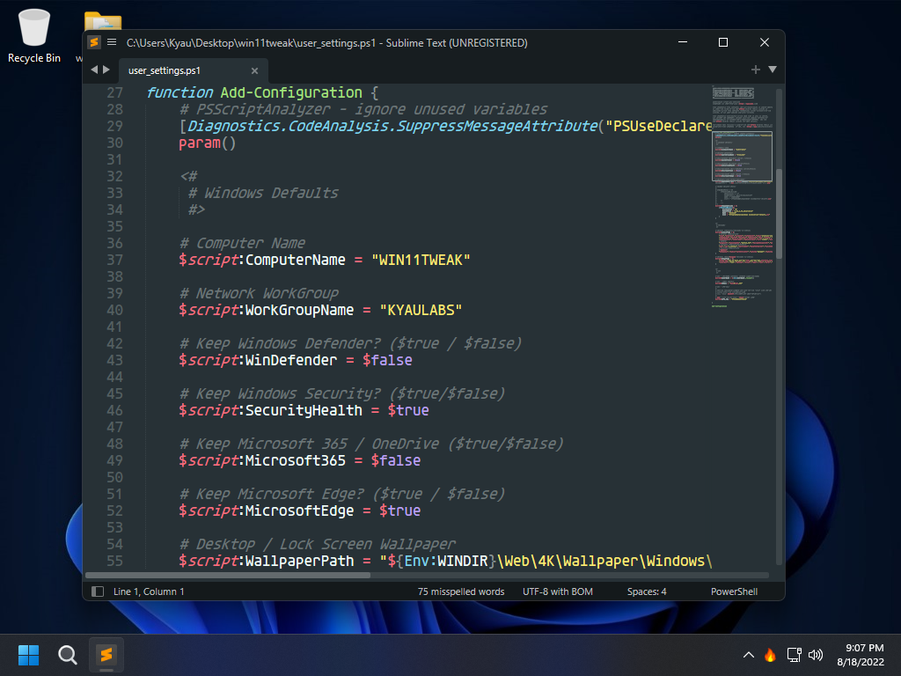
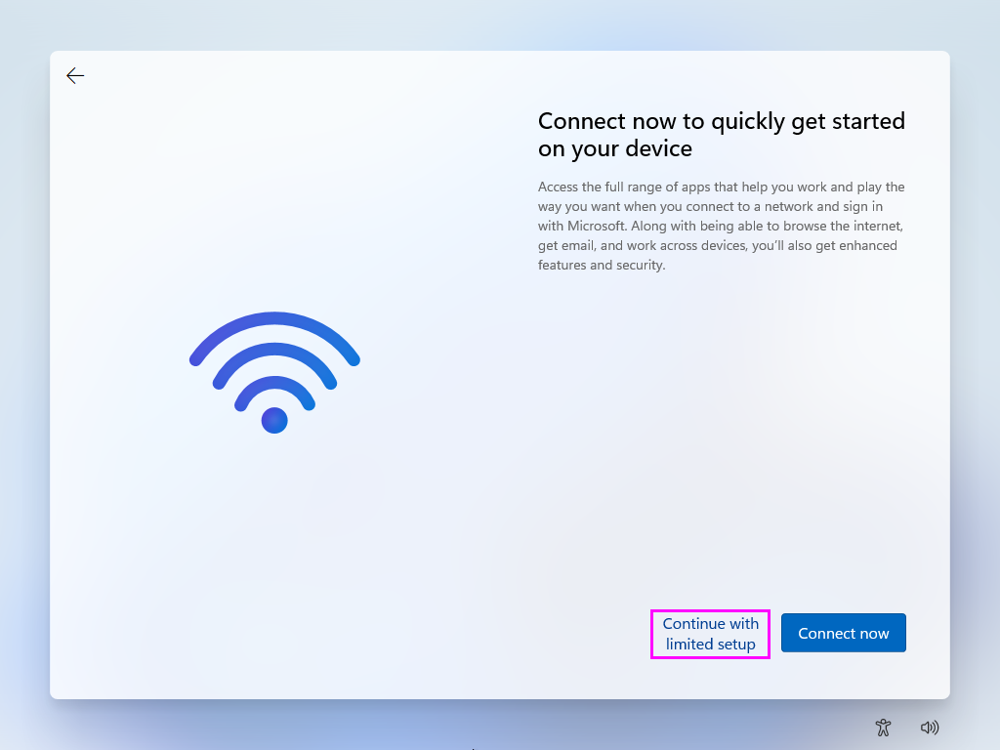
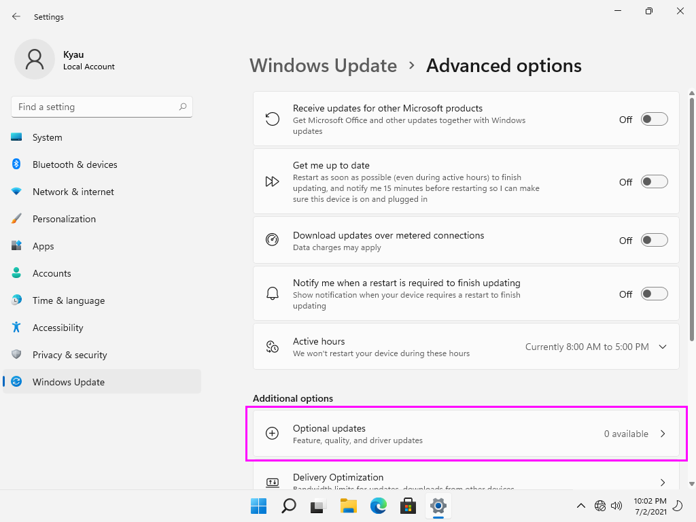
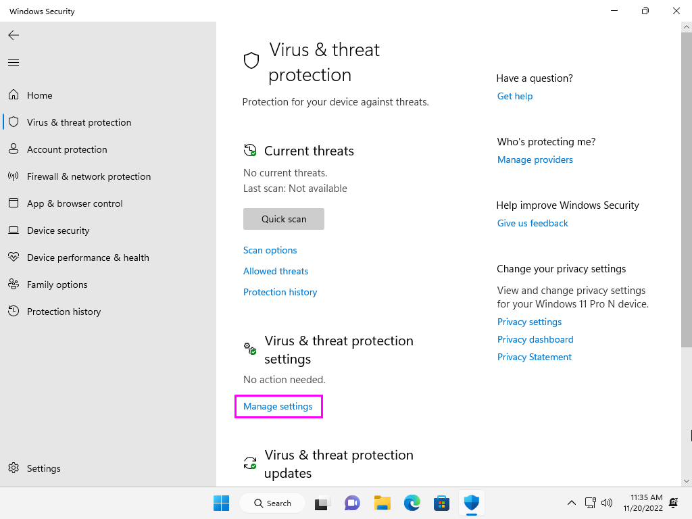
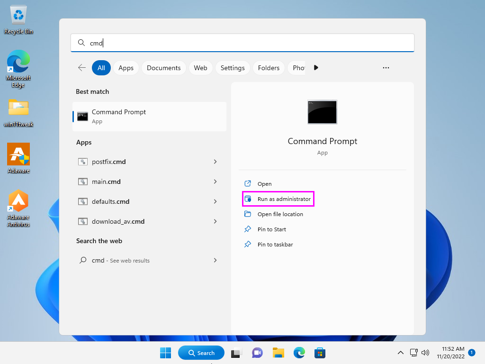
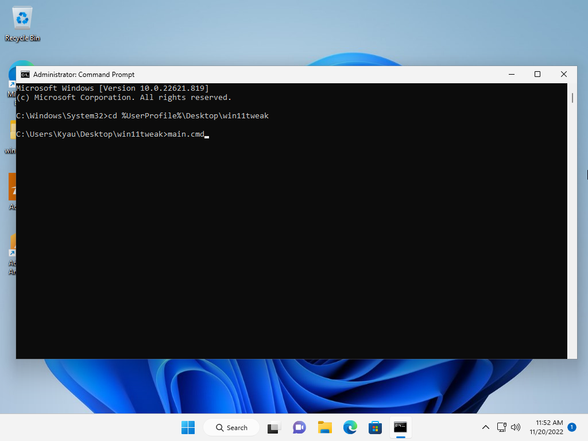
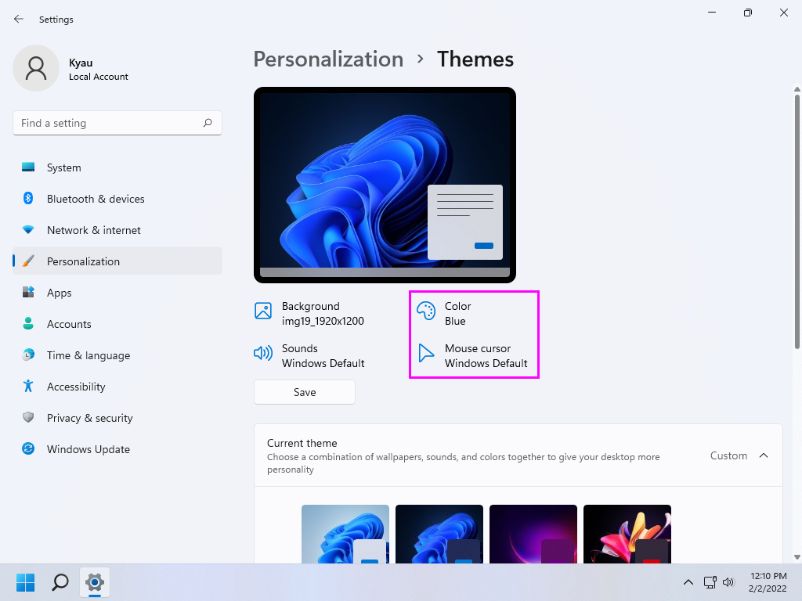
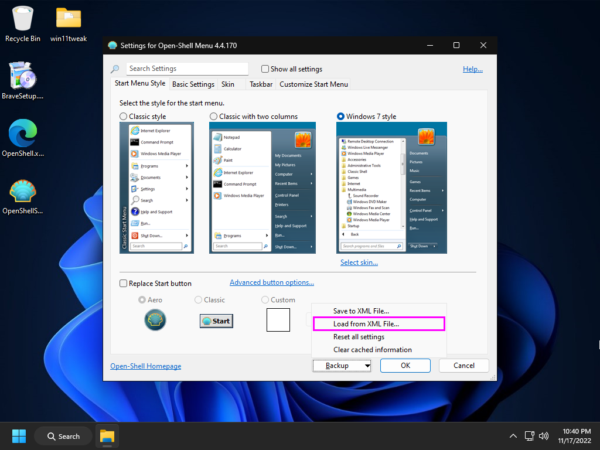
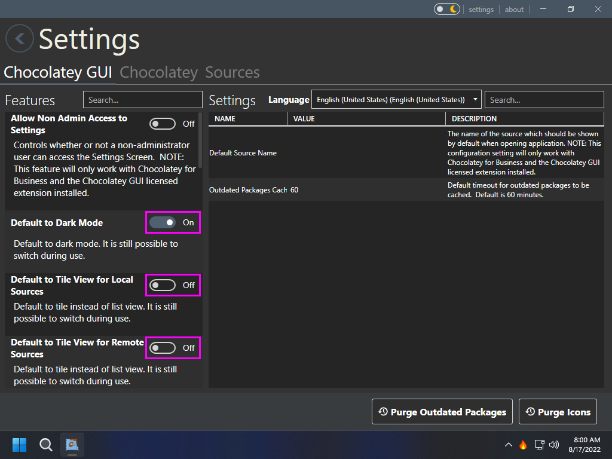

#   Windows 11 Tweaks - Build 22000.434

## Disclaimer

Let's be honest, Windows has become a mammoth of an OS that is generically geared toward everyone. My goal with this set of scripts is to put the User back in control of the OS. That said, these scripts have been heavily customized to my own personal needs, it is highly recommended that if you are to use them you review them in their entirety first.

*This repository is provided for archival/educational purposes, I am not responsible for any data loss or damage that may ensue.*

## Introduction

This script is meant to be utilized immediately after a fresh installation of Windows 11. Before the script can be run, Windows itself needs to be installed properly. The following will walk you through setting up Windows 11 with a local user account. This guide can also be adapted to be used with a Domain Account, however Microsoft Accounts will not work.

## Features

This set of scripts attempts to maintain a vanilla appearance while gutting most of the unneeded and/or unwanted items from the operating system. Privacy is another focus and as such any call home or telemetry functions have been disabled or out-right removed.

Similar to Linux or Mac OSX a package manager will be installed to manage software updates. If you do not look at any other part of the script it is encouraged upon you to at least read the list of software that chocolatey (the package manager) will be installing by default.

GPG, Git and SSH have all been configured to work via the new Windows Terminal.

### Configuration

While not required, in order to personalize your installation, it is recommended to edit `user_settings.ps1`.  Use any text editor or regular old Notepad to edit the file. This step will need to be done before the script can be run on a fresh installation. However, as Win11Tweaks can be baked into an installation to be run automatically, I have added this section up near the top so it does not get skipped over.

*By default this file contains all of my own personal settings. At the very least you should change the Git Email, GPG Public Key and then review over the list of software that Chocolatey is going to be installing.*

## Windows 11 Tweaks Guide

### Installation

While this can be used with any version of Windows 11, this guide revolves around Windows 11 Pro N. In order to bypass the Microsoft Account requirements it is advised that you pull your network cable until Windows 11 is fully installed.

*While broken in the original leaked versions of Windows 11, all of the N version installs are now working as intended.*

After installing Windows to the selected hard drive you will be prompted to reboot the computer. Upon completion you will begin the configuration of Windows. Begin by selecting a region and keyboard (and a secondary keyboard layout if necessary).

Windows will now configure itself for a moment and then ask you to name the current device.

Windows will now finalize the setup by rebooting with the new device name. Once it boots back into the setup you will be prompted with the device setup. Choose `Set up for personal use`.

Being prompted for sign in, select `Sign-in options`.

Finally selecting the desired option `Offline account`.

And confirm your decision by selecting `Skip for now`.

Set your desired username.

Set and confirm your password.

Fill in the three security questions.

Finally on the privacy settings screen, make sure you deselect every single option (scroll down for more options). Only after you have turned off all of Microsoft's tracking should you select `Accept` to complete the Windows 11 configuration.

### Windows Update

Eventually you will be able to login and will be presented with the desktop.

*Note: now would be an acceptable time to plug your network cable back in.*

Right-click on the Start Menu icon (bottom center of screen, left most icon). From here you will want to select `Settings`.

Navigate to `Update & Security`.

From here update Windows, you need to continue to check for updates after every update until Windows tells you that `You're up to date`.

Don't forget to also install optional updates as these tend to contain drivers.

*Note: these have been moved inside Advanced options.*

This will most likely require a reboot or a few. Once complete open the Windows Store from the taskbar (the briefcase with the Windows logo on it). Open the `Library` from the bottom left of the app.

Select `Get updates` in the upper right corner of the window.

Verify that you have performed all updates by the store telling you `You're good to go`.

At this point (if it has not been done already) activate Windows.

With the computer updated and activated it is now time to download the script. Download the latest version of Win11Tweaks. Extract the contents of the ZIP file to the Desktop, this should place a folder `wintweak` on the Desktop.

### Anti-Virus (optional)

*This section is only required if you chosen to disable Windows Defender in the Win11Tweaks config.*

Before the main script can be run Windows Defender needs to be disabled along with tamper protection.

*While this use to be possible via script in Windows 10, Microsoft has made significant changes to this over the course of Windows 11 development and now much of the process needs to be performed manually.*

Select the Security Center icon in the system tray and navigate to the security dashboard.

Navigate to `Virus & threat protection` and select `Manage settings`.

Turn off `Real-time protection`,  `Cloud-delivered protection`, `Automatic sample submission` and `Tamper Protection` inside of Virus & threat protection settings.

Next install Kaspersky Security Cloud free edition from inside the `win11tweak\Tools` folder on the Desktop. Uncheck all additional options during install. 

Once installed, sign up with a throw-away email address in order to get the software enabled (no need to signup for premium).

Finally, once it is finished you should be greeted with the Free edition and a notification that says `Protection is enabled`. Click the settings icon in the bottom left.

In the `Protection` tab disable everything except `File Anti-Virus`.

Finally, navigate to the `Interface` tab and disable all of the `News notifications` and `Promotional materials`. Save and close the KSC (Kaspersky Security Cloud) window.

Kaspersky needs to stay installed until you have completed this guide. At which point you can choose to uninstall Kaspersky VPN and retain anti-virus protection or remove Kaspersky Security Cloud/VPN, which will in turn leave you with Anti-Virus completely disabled.

*Installation of a 3rd party Anti-Virus product has been added in order to get Windows Defender to disable itself. Without this step you will be unable to completely remove Windows Defender from Windows 11.*

### Tweaks

Assuming the scripts have been extracted to your Desktop... Open the start menu and search for `cmd`, this should bring up the listing for Command Prompt. Make sure you choose the option on the right `Run as administrator`.

*Warning: Do not simply run the script from Windows Explorer, this will fail and/or produce unintentional results.*

Change directory into the extracted folder `cd %USERPROFILE%\Desktop\win11tweak`. 

Finally run the script using `main.cmd`.

The script will take quite a while to finish, at some point it will ask you to uninstall the two Microsoft Edge components. If this happens you will be presented with the following screen, make sure to select `Uninstall` for both.

*Note: it is possible that the second of which, uninstalling MSEdge itself, will popup two Internet Explorer errors in the background. These errors will need to be cleared by ALT+TABing and selecting `OK` before the script can continue.*

Once the script reaches the section where it starts to install third-party applications you will see the following popup on the screen, simply click `OK` to continue. It will not reboot instantly.

Upon completion it will reboot automatically. After the reboot the last part of the script will run automatically after login and then remove itself (via scheduled task).

### Configuring Windows

Right-click on the desktop and choose `Personalize`. Navigate to `Themes` and set the mouse cursor theme to `Snow Leopard`.

Click `Color`, change `Choose your color` to `Custom` and then the default Windows mode to `Dark` and the default App mode to `Light`.

Set the accent color to `Manual` then click `View colors`. Selecting `More` will allow you to set a hex color code. Change it to `#131313` (Black) and enable accent color on `Start, taskbar, and action center` and `Title bars and window borders`.

### Windows Terminal

Windows Terminal (WT) is now the defacto Windows terminal and can easily be used for CMD, PowerShell, SSH, WSL and more. To access WT right-click the Start Menu and select `Windows Terminal (Admin)`. Select `Open Settings` from the toolbar warning about the default terminal application.

Once open, use the dropdown menu underneath `Default terminal application` and select `Windows Terminal`, then click `Save` in the bottom right.

After OpenShell is installed you will find example shortcuts for SSH and RDP in the Start Menu under the KYAU Labs section (feel free to rename to the name of your network).

### OpenShell

OpenShell, which is the continued version of ClassicShell, should be on the desktop with a settings XML file ready for import. Install OpenShell, removing the un-needed modules.

After installation press the windows key on your keyboard in order to open the settings dialog for Open-Shell. Click `Backup` and then `Load from an XML file...` choosing the provided XML file on the desktop.

*Note: OpenShell has not yet been fully updated for Windows 11, there are still quite a few bugs/glitches.*

If you need to make changes to the Start Menu, enable `Show all settings` and then navigate to the `Customize Start Menu` tab.

When finished, select `OK` in the bottom right to save the changes. It will prompt you to Exit and reload OpenShell. Right-click the Start Menu and choose `Exit` (maybe twice). Then click the Start Menu and re-launch `Open-Shell Menu Settings`. Finally, select `OK` to close settings.

### Brave

Next, install the Brave web browser with the `BraveSetup.exe` on the desktop which has been pre-downloaded for you. Once open, feel free to click `Skip tour` in the bottom-left corner.

Navigate to the hamburger menu in the upper-right and select `Extensions`. In the center you should see `Find extensions and themes in the Web Store`, click on `Web Store` to continue, this should launch in a separate tab.

Extensions are typical revolve heavily around personal choice, however there are a few extensions that deal with privacy/security that I would recommend to everyone.

* [Cookie AutoDelete](https://chrome.google.com/webstore/detail/cookie-autodelete/fhcgjolkccmbidfldomjliifgaodjagh)
* [Decentraleyes](https://chrome.google.com/webstore/detail/decentraleyes/ldpochfccmkkmhdbclfhpagapcfdljkj)
* [Enhancer for YouTube™](https://chrome.google.com/webstore/detail/enhancer-for-youtube/ponfpcnoihfmfllpaingbgckeeldkhle)
* [HTTPS Everywhere](https://chrome.google.com/webstore/detail/https-everywhere/gcbommkclmclpchllfjekcdonpmejbdp)
* [Privacy Badger](https://chrome.google.com/webstore/detail/privacy-badger/pkehgijcmpdhfbdbbnkijodmdjhbjlgp)

### Firewall

In the Utilities section of the Start Menu is simplewall, launch it and allow it to update if needed.

In the `Settings` menu enable `Load on system startup`,  `Start minimized`, and `Skip "User Account Control" prompt warning`.

Click `Enable filters` in the toolbar then again in the popup dialog in order to permanently replace the Windows Firewall with SimpleWall.

Applications will popup asking for internet access, stuff that is required for Windows to function are as follows (it is safe to allow everything in this list):

* `dashost.exe`: wired/wireless device pairing
* `explorer.exe`: typically for SMB of NFS access (network drives)
* `Microsoft Content`: part of search
* `Microsoft Store`: the store uwp app
* `mousocoreworker.exe`: Windows update client
* `mstsc.exe`: remote desktop connection
* `sihclient.exe`: Windows update background installer
* `simplewall.exe`: 3rd party firewall
* `spoolsv.exe`: network printing
* `sppextcomobj.exe`: KMS connection broker
* `svchost.exe`: Windows service host process
* `System`: Windows NT kernel
* `systemsettings.exe`: Windows update related
* `usocoreworker.exe`: Windows update client

NVIDIA Graphics Cards Allow List:

* `nvcontainer.exe`: NVIDIA display driver
* `nvdisplay.container.exe` NVIDIA display driver
* `nvidia geforce experience.exe`: NVIDIA display driver
* `nvidia notification.exe`: NVIDIA display driver
* `nvidia share.exe`: NVIDIA display driver
* `nvidia web helper.exe`: NVIDIA display driver

Default Application Allow List:

* `autoruns.exe`: Autoruns VirusTotal scanning capability
* `brave.exe`: Web browser
* `ccenhancer.exe`: CCEnhancer downloader
* `ccleaner64.exe`: Utilities > CCleaner
* `chocolateygui.exe`: Chocolatey GUI is the interface for the package manager
* `exodus.exe`: Exodus crypto wallet w/ hardware support
* `heidisql.exe`: SQL client
* `igcmd.exe`: ImageGlass image viewer update checker
* `nextcloud.exe`: Nextcloud cloud service client
* `sharex.exe`: ShareX screenshot auto uploading
* `sublime_text.exe`: Sublime Text 4 package manager and update checker

Things to block:

* `ccupdate`: CCleaner update checker
* `devicecensus.exe`: Microsoft telemetry
* `dxdiag.exe`: DirectX diagnostic
* `foxitpdfreader.exe`: Foxit PDF Reader (pdf's themselves do not need internet)
* `foxitpdfreaderupdater.exe`: Foxit PDF Reader update checker
* `keepassxc.exe`: KeePassXC update checker
* `microsoftedgeupdate.exe`: Microsoft Web Browser Update
* `msedge.exe`: Microsoft Web Browser (if you are using a different one)
* `msiexec.exe`: Microsoft Installer (system32 and syswow64)
* `onedrivesetup.exe`: if you are not using OneDrive
* `taskhostw.exe`: Scheduled tasks shouldn't need network access (unless you run tasks that do)
* `wermgr.exe`: Windows error reporting manager (telemetry)
* `Windows Feature Experience Pack`: Windows Start Menu ads and telemetry

Past this, things to allow are at your discretion. Generally I won't allow any installers access to the internet unless they need to download the installation material, and then I give them timed access (only 10 minutes for example). Some things will be easy to choose to allow; like a web browser or email client.

When in doubt, choose the `X` instead of block and if the program fails to work, re-launch the program and you will be asked again and can this time select allow.

### Chocolatey

Launch the package manager `Chocolatey GUI` from the Start Menu in the Utilities submenu. Click the `settings` button in the upper right of the application.

Turn off the options `DefaultToTileViewForLocalSource` and `DefaultToTileViewForRemoteSource`.

Scroll to the bottom and enable the two options `DefaultToDarkMode` and `PreventUsageOfUpdateAllButton`. Closing setting by clicking the round left arrow button to the left of the Settings title.

When updates are detected you will see a new version listed to the right of current versions highlighted with the color red. To update, simple right click the application and choose `Update`.

## Attribution & References

Without all of the following this guide would not have been possible.

* [Windows 10 Privacy Guide - 1903 Update](https://github.com/adolfintel/Windows10-Privacy)
* [tweaks & fixes for windows 10 - mostly powershell](https://github.com/equk/windows)
* [Win10 Initial Setup Script](https://github.com/Disassembler0/Win10-Initial-Setup-Script)
* [Windows TenForums](https://www.tenforums.com/)
* [Summary of AV Test Results - Jan 2022](https://www.reddit.com/r/antivirus/comments/rzw1me/summary_of_av_test_results_january_2022/)
* [Flat-Remix Icon Theme](https://github.com/daniruiz/flat-remix)
* [agave font](https://github.com/agarick/agave)
* [Mixed wallpaper](https://www.deviantart.com/i5yal/art/Mixed-wallpaper-744877376)
