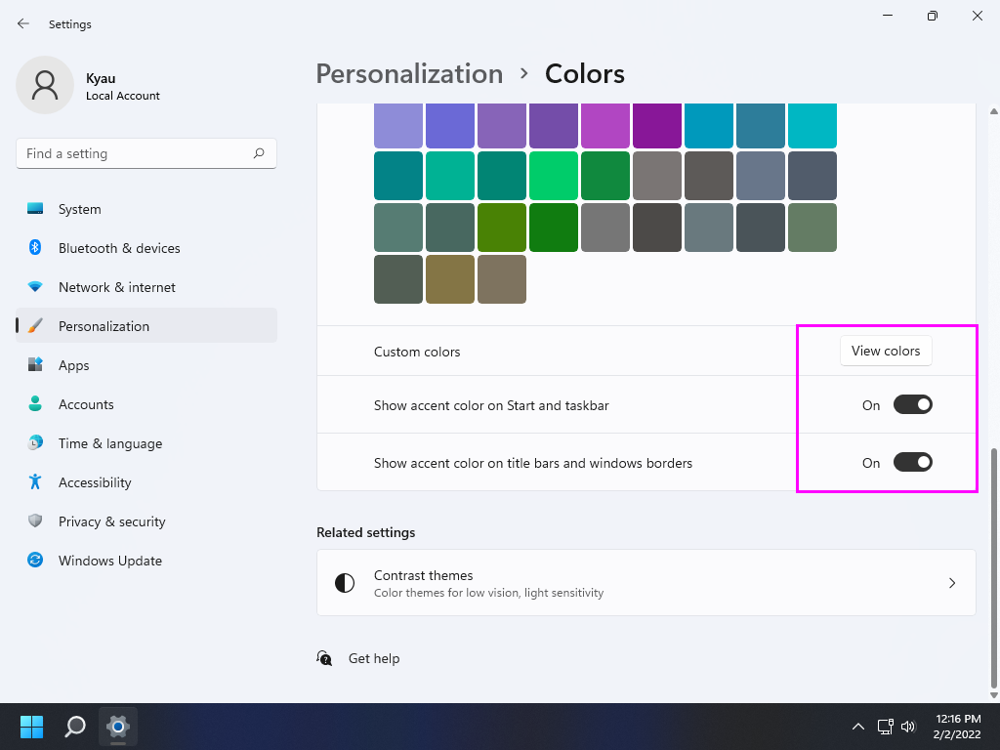

# Windows 11 Tweaks - Build 21996

## Disclaimer

Let's be honest, Windows has become a mammoth of an OS that is generically geared toward everyone. My goal with this set of scripts is to put the User back in control of the OS. That said, these scripts have been heavily customized to my own personal needs, it is highly recommended that if you are to use them you review them in their entirety first.

*This repository is provided for archival/educational purposes, I am not responsible for any data loss or damage that may ensue.*

## Introduction

This script is meant to be utilized immediately after a fresh installation of Windows 11. Before the script can be run, Windows itself needs to be installed properly. The following will walk you through setting up Windows 11 with a local user account. This guide can also be adapted to be used with a Domain Account, however Microsoft Accounts will not work.

## Features

## Windows 11 Tweaks Guide

### Installation

While this can be used with any version of Windows 11, this guide revolves around Windows 11 Pro N.

*At this time of this writing, all of the N installs have a broken OOBE which results in a black screen upon first boot after install.*

After installing Windows to the selected hard drive you will be prompted to reboot the computer. Upon completion you will begin the configuration of Windows. Begin by selecting a region and keyboard.

Designate that you are setting up a Windows for personal use.

On the Sign In with Microsoft screen, select `Sign-in options`.

Confirm that you wish you use an offline account.

Confirm again that you wish to have a limited experience.

Choose a username.

Set and confirm your password.

Fill in the three security questions.

Finally on the privacy settings screen, make sure you deselect every single option (scroll down for more options). Only after you have turned off all of Microsoft's tracking should you select `Accept` to complete the Windows 11 configuration.

### Windows Update

Eventually you will be able to login and will be presented with the desktop. Right-click on the Start Menu icon (bottom center of screen, left most icon). From here you will want to select `Settings`.

Navigate to `Update & Security`.

From here update Windows, you need to continue to check for updates after every update until Windows tells you that `You're up to date`.

Don't forget to also install optional updates as these tend to contain drivers.

This will most likely require a reboot or a few. Once complete open the Windows Store from the taskbar (the briefcase with the Windows logo on it). Open the extras menu and select `Downloads and updates`.

Select `Get updates` in the upper right corner of the window.

Verify that you have performed all updates by the store telling you `You're good to go`.

At this point the only thing left to do (if it has not been done already) is to activate Windows.

### Tweaks

With the computer configured and updated it is now time to run the script. Make sure you have downloaded the script from GitHub.

Assuming the scripts have been extracted to your Desktop... Open the start menu and search for `cmd`, this should bring up the listing for Command Prompt. Make sure you choose the option on the right `Run as administrator`.

Change directory into the extracted folder `cd %USERPROFILE%\Desktop\win11tweak`. 

Finally run the script using `main.cmd`.

The script will take quite a while to finish, upon completion it will reboot automatically. After the reboot the last part of the script will run automatically after login (scheduled task) and then remove itself.

### Configuring Windows

Right-click on the desktop and choose `Personalize`. Set the mouse cursor theme to `Snow Leopard`.

Set `Choose your color` to `Custom` and then the default Windows mode to `Dark` and the default App mode to `Light`.

Set the accent color to a custom color of `#131313` (Black) and enable accent color on `Start, taskbar, and action center` and `Title bars and window borders`.

OpenShell, which is the new version of ClassicShell should be on the desktop with a settings XML file. Install, removing Classic Explorer and Classic IE (do not install these). After installation click on the Start Menu in order to open the Settings for Open-Shell Menu dialog. Select `Backup` and then `Load from an XML file...` choosing the provided XML file on the desktop.

*Note: OpenShell has not yet been updated for Windows 11, as such if you run the start menu in the center instead of the left you will run into issues.*

Select `OK` to save the changes.

### Firewall

In the Utilities section of the Start Menu is simplewall. Launch and allow it to update. In the Blacklist menu change 'Microsoft update servers' to 'Allow' then select the `Enable filters` button in the toolbar, permanently replacing Windows Firewall.

Some Windows applications that will popup asking for internet access that should be allowed are as follows:

* `dashost.exe`: wired/wireless device pairing
* `explorer.exe`: typically for SMB of NFS access (network drives)
* `lsass.exe`: *???*
* `Microsoft Content`: part of search
* `Microsoft Store`: the store uwp app
* `mousocoreworker.exe`: Windows update client
* `mstsc.exe`: remote desktop connection
* `nvcontainer.exe`: NVIDIA display driver
* `nvdisplay.container.exe` NVIDIA display driver
* `nvidia geforce experience.exe`: NVIDIA display driver
* `nvidia notification.exe`: NVIDIA display driver
* `nvidia share.exe`: NVIDIA display driver
* `nvidia web helper.exe`: NVIDIA display driver
* `sihclient.exe`: Windows update background installer
* `simplewall.exe`: 3rd party firewall
* `spoolsv.exe`: network printing
* `sppextcomobj.exe`: KMS connection broker
* `svchost.exe`: Windows service host process
* `System`: Windows NT kernel
* `systemsettings.exe`: *???*
* `usocoreworker.exe`: Windows update client

Things to block:

* `devicecensus.exe`: Microsoft telemetry
* `dxdiag.exe`: DirectX diagnostic
* `microsoftedgeupdate.exe`: Microsoft Web Browser Update
* `msedge.exe`: Microsoft Web Browser (if you are using a different one)
* `msiexec.exe`: Microsoft Installer (system32 and syswow64)
* `onedrivesetup.exe`: if you are not using OneDrive

Past this, things to allow are at your discretion. Generally I won't allow any installers access to the internet unless they need to download the installation material. Some things will be easy to choose to allow; like a web browser or email client.

When in doubt, choose the `X` instead of block and if the program fails to work, re-launch the program and choose to allow it this time.

## Attribution & References

Without all of the following this guide would not have been possible.

* [Windows 10 Privacy Guide - 1903 Update](https://github.com/adolfintel/Windows10-Privacy)
* [tweaks & fixes for windows 10 - mostly powershell](https://github.com/equk/windows)
* [Win10 Initial Setup Script](https://github.com/Disassembler0/Win10-Initial-Setup-Script)
* [Windows TenForums](https://www.tenforums.com/)
* [Flat-Remix Icon Theme](https://github.com/daniruiz/flat-remix)
* [agave font](https://github.com/agarick/agave)
* [Mixed wallpaper](https://www.deviantart.com/i5yal/art/Mixed-wallpaper-744877376)
